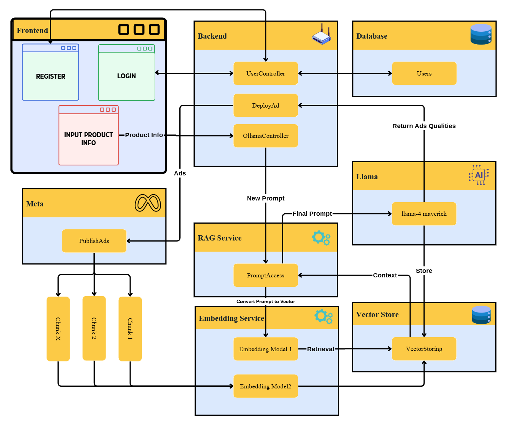

# LENAI StartUp House Hackathon Project



## Project Overview

**LENAI StartUp House** is a hackathon project designed to demonstrate a modern, full-stack startup application. The project combines a **React** frontend with a **.NET** backend to provide a smooth and responsive user experience, along with reliable backend processing.

This project showcases how frontend and backend systems can work together seamlessly in a startup environment, emphasizing scalability, performance, and modern design practices.

---

## Features

- **Modern Frontend:** Developed using React, ensuring a responsive, dynamic, and user-friendly interface.
- **Robust Backend:** Built with .NET, handling all business logic, API routes, and database interactions.
- **Full-Stack Integration:** Smooth communication between frontend and backend using RESTful APIs.
- **Scalable Architecture:** Designed to allow easy expansion and feature addition in the future.
- **Clean Code Practices:** Follows standard coding conventions for readability and maintainability.

---

## Project Structure

```
LENAI-StartUp-House-Hackathon/
├── ModernStartup/         # React frontend source code
│   ├── src/
│   └── public/
├── Backend/               # .NET backend source code
│   ├── Controllers/
│   ├── Models/
│   └── Services/
├── Photos/                # Screenshots and system design images
│   └── SystemDesign.png
└── LENAI-StartUp-House-Hackathon.sln
```

---

## Installation & Running the Project

### Frontend Setup
1. Navigate to the frontend folder:
```bash
cd ModernStartup
```
2. Install dependencies:
```bash
npm install
```
3. Start the development server:
```bash
npm start
```
4. Open your browser at [http://localhost:3000](http://localhost:3000)

### Backend Setup
1. Navigate to the backend folder:
```bash
cd Backend
```
2. Restore dependencies:
```bash
dotnet restore
```
3. Run the backend server:
```bash
dotnet run
```
4. Backend APIs will be available at [http://localhost:5000](http://localhost:5000)

---

## Technologies Used

- **Frontend:** React, JavaScript/TypeScript, Tailwind CSS
- **Backend:** .NET Core / .NET 7, C#
- **Database:** (Add your database here if applicable)
- **Version Control:** Git, GitHub
- **Development Tools:** Visual Studio, VS Code

---

## System Architecture

The system is designed to separate frontend and backend concerns while maintaining smooth integration. The architecture includes:

1. **Frontend (React):** Handles UI, state management, and user interactions.
2. **Backend (.NET):** Processes requests, performs business logic, and communicates with the database.
3. **Database (if applicable):** Stores persistent data such as user information, product data, or application state.
4. **Communication:** RESTful APIs connect the frontend and backend.

**System Design Diagram:**


---

## Example Screenshots

These example screenshots illustrate the frontend and backend functionality:

**Frontend Example 1**  


**Frontend Example 2**  


**Backend Example**  


---

## Contributing

Contributions are welcome! You can help by:

- Reporting bugs
- Suggesting new features
- Improving documentation
- Submitting pull requests

Please follow standard GitHub workflow for contributions.

---

## License

This project is licensed under the **MIT License**.  

---

**GitHub Repository:** [https://github.com/furkanbaran5/LENAI-StartUp-House-Hackathon](https://github.com/furkanbaran5/LENAI-StartUp-House-Hackathon)
