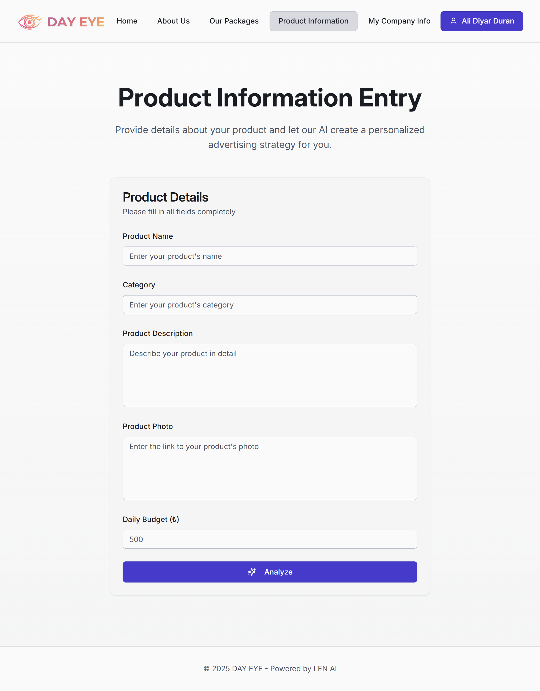
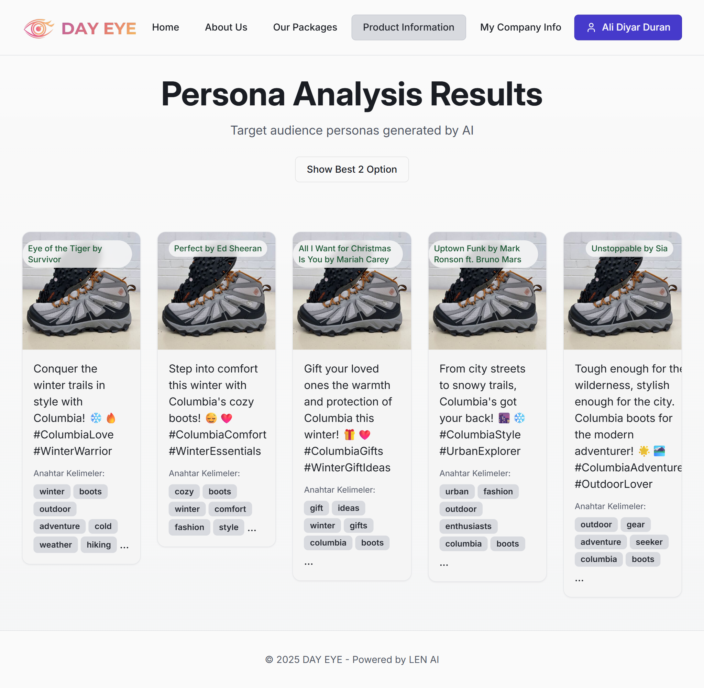
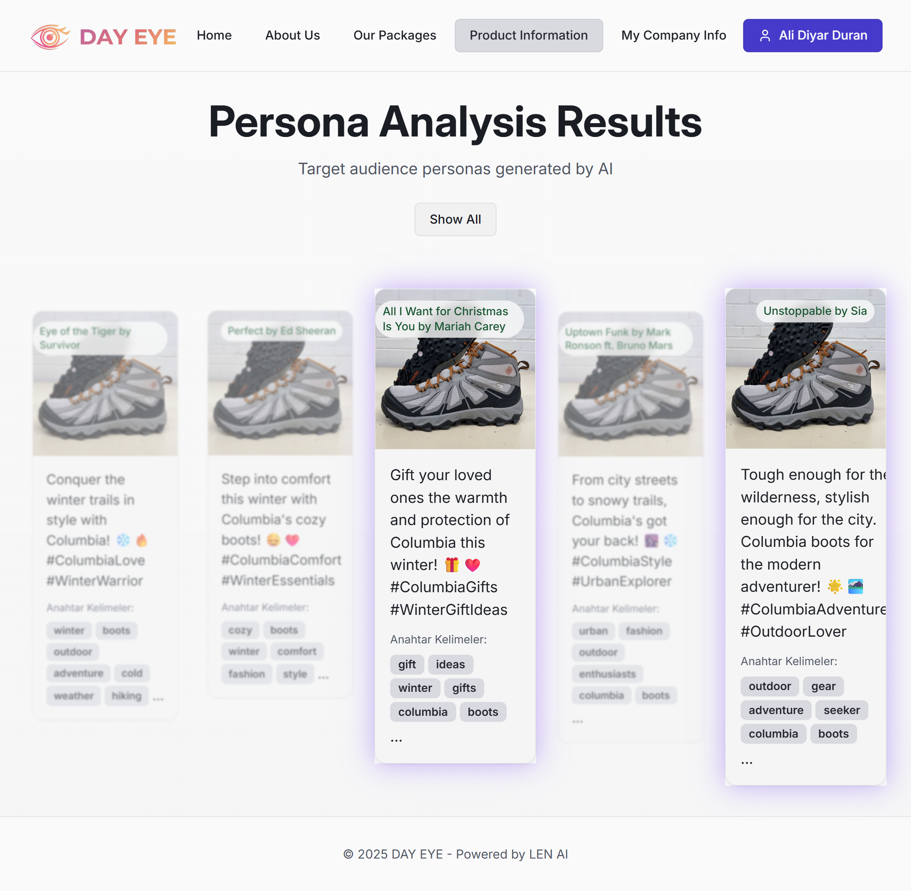
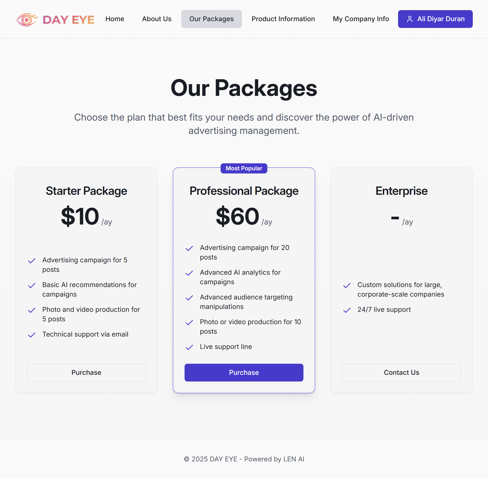
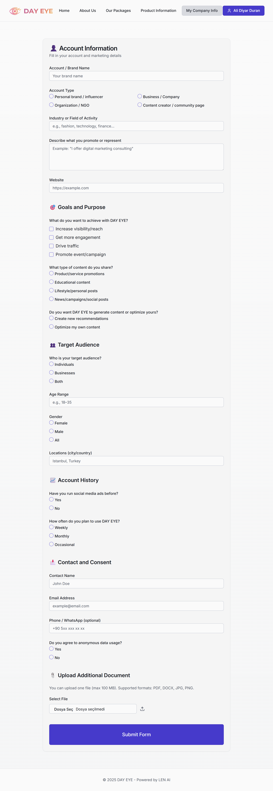

# LENAI StartUp House Hackathon Project

## Project Overview

**DAY EYE** is an AI-powered platform designed to help businesses create, analyze, and optimize social media advertisements with state-of-the-art Large Language Models (LLMs). The project leverages **Llama 4 Maverick** and **Retrieval-Augmented Generation (RAG)** techniques to provide actionable insights and automated ad creation tailored for user needs.  

Our platform focuses on delivering intelligent ad strategies by connecting AI capabilities with **Meta’s advertising ecosystem**, allowing sponsored campaigns to be deployed directly on Meta platforms.

---

## Key Features

- **AI-Driven Ad Analysis:** The system analyzes existing advertisements and provides performance insights, helping users optimize content for engagement and conversions.
- **Automated Ad Generation:** Using **Llama 4 Maverick**, the platform generates multiple ad variations tailored for different audiences.
- **RAG + Vector Storage:** Large amounts of data are chunked and stored in vector databases, enabling the AI to retrieve relevant information quickly for contextual and accurate content generation.
- **Meta Integration:** Advertisements can be directly sponsored and published on Meta platforms through integrated APIs.
- **Customizable Campaigns:** Users can target specific audience segments, including demographics, interests, and behavioral data, leveraging AI recommendations.

---

## How It Works

1. **Data Ingestion:** User-provided content, past ads, and external knowledge sources are processed and chunked.
2. **Vector Storage:** Chunks are stored in a vector database for efficient similarity search and retrieval.
3. **RAG Querying:** When generating ads, the system queries the vector database to retrieve relevant context.
4. **LLM Generation:** Llama 4 Maverick generates ad copy and strategies based on retrieved information.
5. **Meta Deployment:** Users can publish the generated ads directly to Meta platforms with proper targeting and sponsorship.

**Architecture Diagram:**  


---

## Technologies Used

- **Large Language Model:** Llama 4 Maverick
- **RAG Pipeline:** Retrieval-Augmented Generation for contextual ad generation
- **Vector Database:** Stores chunked knowledge for fast semantic retrieval
- **Backend API:** Handles AI processing, vector queries, and Meta integration
- **Frontend:** React-based interface for user interactions
- **Meta Ads API:** Used for publishing and sponsoring advertisements

---

## Project Structure

```
LENAI-StartUp-House-Hackathon/
├── FrontEnd/        # Frontend React interface
├── Backend/              # API for AI processing and Meta integration
├── Photos/               # Screenshots and architecture diagram
└── README.md
```

---

## Use Cases

1. **Small Business Owners:** Generate effective ads without requiring in-depth marketing knowledge.
2. **Digital Marketing Teams:** Automate campaign creation and analyze multiple ad variations quickly.
3. **Content Creators & Agencies:** Optimize ad engagement by leveraging AI-generated strategies based on historical data and trends.

## Screenshots

These screenshots illustrate the system, AI workflows, and ad generation interface:

**Input Page**  


**Output Page-1**  


**Output Page-2**  


**Subscribtion**  


**Form Page**  


---
## Contact

DEVELOPER:
[LinkedIn](https://www.linkedin.com/in/furkanbaran5/)  
furkanbarann5@gmail.com

PRODUCT MANAGER:
[LinkedIn](https://www.linkedin.com/in/diyar-duran/)  
alidiyarduran35@gmail.com

DESIGNER:
[LinkedIn](https://www.linkedin.com/in/sadikahmetfirat0/)  
sadikahmetfirat@gmail.com
